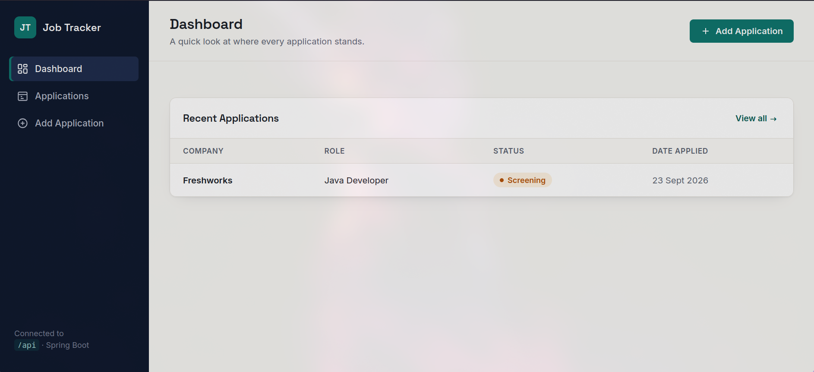
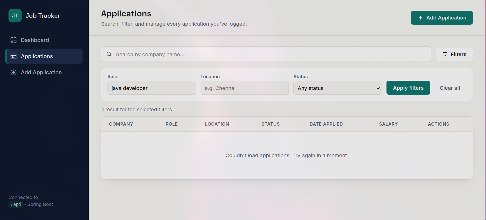
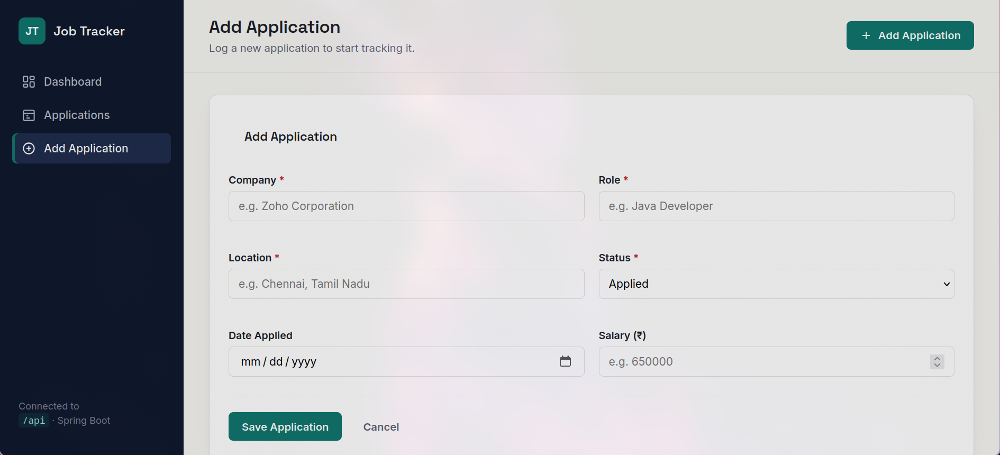

# Job Application Tracker

A full-stack web application for tracking job applications, managing application statuses, searching applications, and viewing application statistics.

## Screenshots

### Dashboard



### Applications and Advanced Filtering



### Add Application



## Features

- Add new job applications
- View all applications
- Edit existing applications
- Delete applications
- Search applications by company
- Search applications by role
- Search applications by location
- Filter applications by status
- Combine multiple search filters
- Dashboard with application statistics
- Status badges for application stages
- Responsive web interface
- REST API backend
- MySQL database persistence

## Tech Stack

### Backend
- Java 21
- Spring Boot 4.0.1
- Spring Web
- Spring Data JPA
- Hibernate
- Jakarta Validation
- Maven

### Frontend
- HTML5
- CSS3
- Vanilla JavaScript

### Database
- MySQL

### Development Tools
- Git
- GitHub
- VS Code

## Application Statuses

The application supports six application statuses:

- Applied
- Screening
- Interview
- Offer
- Rejected
- Withdrawn

## Project Structure

```text
job-application-tracker/
├── .mvn/
├── src/
│   ├── main/
│   │   ├── java/
│   │   │   └── com/barath/jobtracker/
│   │   │       ├── controller/
│   │   │       ├── entity/
│   │   │       ├── repository/
│   │   │       └── service/
│   │   └── resources/
│   │       ├── static/
│   │       │   ├── css/
│   │       │   ├── js/
│   │       │   └── index.html
│   │       └── application.properties
│   └── test/
├── .gitignore
├── mvnw
├── mvnw.cmd
├── pom.xml
└── README.md

REST API
Application Endpoints

| Method | Endpoint                 | Description              |
| ------ | ------------------------ | ------------------------ |
| GET    | `/api/applications`      | Get all applications     |
| GET    | `/api/applications/{id}` | Get an application by ID |
| POST   | `/api/applications`      | Create a new application |
| PUT    | `/api/applications/{id}` | Update an application    |
| DELETE | `/api/applications/{id}` | Delete an application    |

Search and Filtering

| Method | Endpoint                               | Description                     |
| ------ | -------------------------------------- | ------------------------------- |
| GET    | `/api/applications/search?company=`    | Search applications by company  |
| GET    | `/api/applications/role?role=`         | Search applications by role     |
| GET    | `/api/applications/location?location=` | Search applications by location |
| GET    | `/api/applications/status?status=`     | Filter applications by status   |
| GET    | `/api/applications/search/advanced`    | Apply multiple filters together |

Dashboard

GET /api/dashboard/stats
Returns application counts for each application status.

Database

The application uses MySQL with the following database: job_tracker

Database credentials are not stored directly in the repository.

The MySQL password is supplied through an environment variable: export DB_PASSWORD='your_mysql_password'

Spring Boot reads the password using: spring.datasource.password=${DB_PASSWORD}

Running the Project

1. Clone the repository

git clone https://github.com/BarathR5/Job-application-tracker.git
cd Job-application-tracker

2. Create the MySQL database

Open MySQL and run: CREATE DATABASE job_tracker;

3. Configure the database password

Linux/macOS: export DB_PASSWORD='your_mysql_password'
$env:DB_PASSWORD="your_mysql_password"

4. Start the Spring Boot application

Linux/macOS:./mvnw spring-boot:run

Windows: mvnw.cmd spring-boot:run

5. Open the application

Open the following URL in your browser: http://localhost:8080

Architecture

                Frontend
        HTML + CSS + JavaScript
                    │
                    │ REST API
                    ▼
          Spring Boot Controllers
                    │
                    ▼
              Service Layer
                    │
                    ▼
            Spring Data JPA
                    │
                    ▼
                 MySQL

API Flow

User
 │
 ▼
Web Interface
 │
 ▼
JavaScript
 │
 ▼
REST API
 │
 ▼
Spring Boot
 │
 ▼
JPA / Hibernate
 │
 ▼
MySQL Database

Validation
201 Created
204 No Content
400 Bad Request
404 Not Found
Dashboard

The dashboard provides an overview of tracked applications, including counts for:

Applied
Screening
Interview
Offer
Rejected
Withdrawn

The total number of applications is calculated from these status counts.

Future Improvements

Possible future improvements include:

User authentication
Pagination and sorting
Job application reminders
Interview scheduling
Resume management
Export applications to CSV or PDF
More detailed analytics
Email notifications
Author
Barath Raj

GitHub: https://github.com/BarathR5